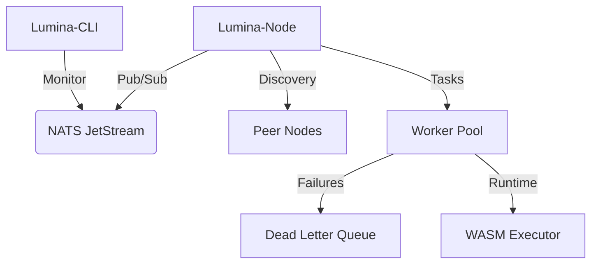

# Lumina-Mesh
The Open-Source Serverless AI Mesh for Edge-to-Cloud Orchestration.

**Lumina-Mesh** is a low-latency, event-driven communication network connecting Docker containers, serverless functions, and AI models. Running entirely on Virtual Containers and Microservices, it orchestrates complex AI workflows (e.g., video processing -> sentiment analysis -> Slack notification) using a single YAML file.

## Architecture
Lumina-Mesh uses a decentralized approach where each node is part of a high-speed messaging mesh.



## Features
- **Core Engine:** Written in Go for optimal concurrency and memory usage.
- **Messaging Layer:** Uses NATS / JetStream for a modern, high-speed pub/sub system.
- **Workflow Definition:** YAML / DSL-based workflows.
- **Runtime Environment:** WebAssembly (WASM) for isolated and cross-platform function execution.
- **AI Processing:** Hugging Face / ONNX integration for local AI inference.
- **Observability:** OpenTelemetry for distributed tracing.

## Getting Started
To start a node, ensure NATS is running:
```bash
docker run -d --name nats -p 4222:4222 nats
go run cmd/lumina/main.go
```
To monitor the mesh:
```bash
go run cmd/lumina-cli/main.go
```
